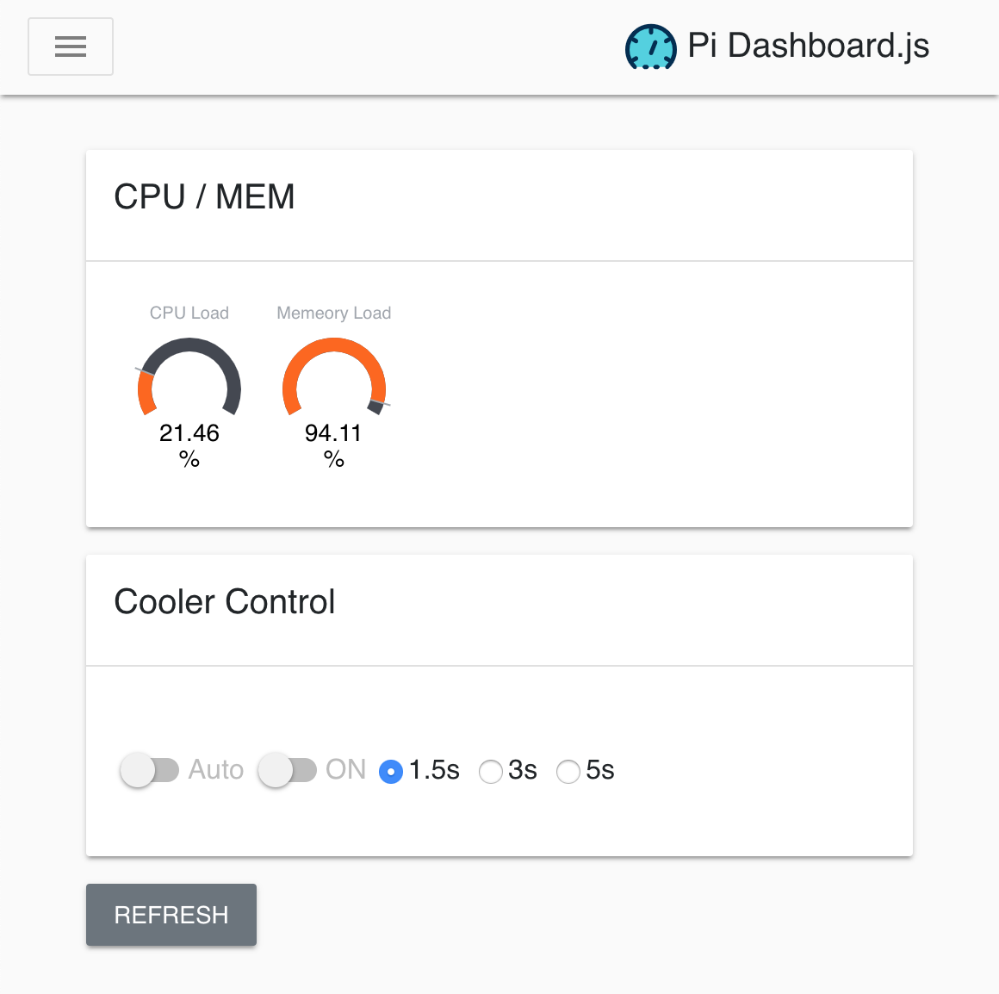

# <div align="center"> PiDashboard.js</div>

<p align="center">
  <a href="https://juejin.im/user/58b50c8e8d6d81005762ba8d"></a>
  <a href="https://juejin.im/post/5bd6a15a518825295071d72c"></a>
  <a href="https://github.com/Mitscherlich/PiDashboard.js/issues"></a>
  <a href="https://github.com/Mitscherlich/PiDashboard.js/pulls"></a>
  <a href="https://github.com/Mitscherlich/PiDashboard.js/blob/master/LICENSE"></a>
</p>

## Preview



## Installation

Simplest way to install is by cloning whole repository:

  ```sh
  $ cd /path/to/workspace
  $ git clone https://github.com/Mitscherlich/PiDashboard.js.git
  $ cd PiDashboard.js && npm install # yarn will also be ok
  ```

> npm package will be available after exhaustive testing

## Usage

Quickest way to start is using the command defined in `package.json`:

  ```sh
  $ npm run dev # yarn will also be ok
  # Go and visit http://127.0.0.1:3000 in your browser
  ```

## License

[MIT](LICENSE)
